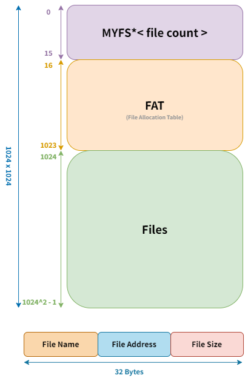

# File System


## System Design



## Table of Contents

- [Installation](#installation)
- [Usage](#usage)


## Installation

To install this project, clone the repository to your local machine using the following command:

```console
$ git clone https://github.com/ItayShallev/File-System.git
```


## Usage
After successfully installing the repository, open a command line, navigate to the project's folder and type the following commands:

```console
$ make
$ ./bin/myfs MyFirstFS
```

The usage of this project follows a similar convention to working with commands in a Linux environment, making it intuitive for users familiar with Linux systems. Additionally, a custom 'help' command is available to provide further assistance and guidance.
